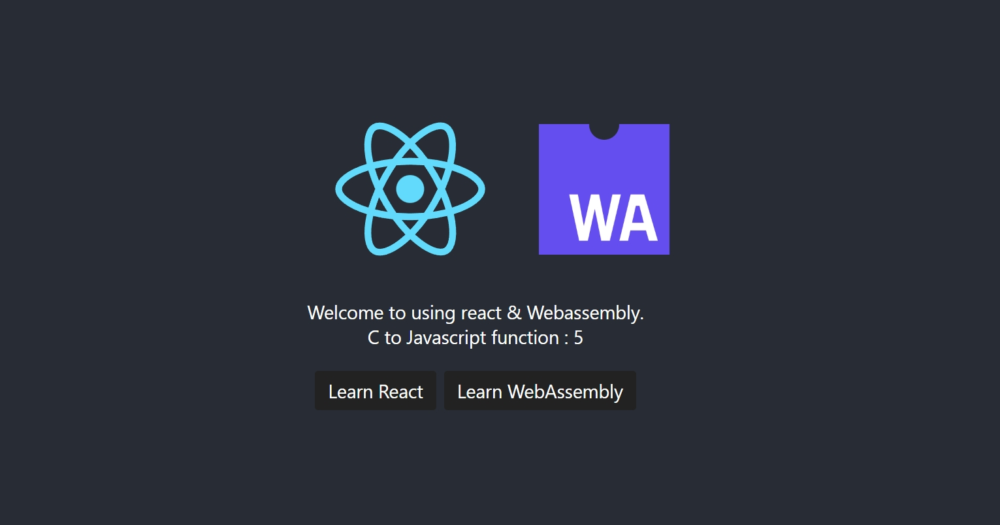

<!-- https://developer.mozilla.org/zh-CN/docs/WebAssembly/C_to_wasm -->
<!-- https://juejin.cn/post/7041485336350261278 -->

- MODULARIZE 模組化，減少import衝突
- EXPORT_ES6 以ES6語法導出
- EXPORT_NAME 模組名稱
- ENVIRONMENT 指定運行環境，這種設置為web

sh 自動化小工具未修正

